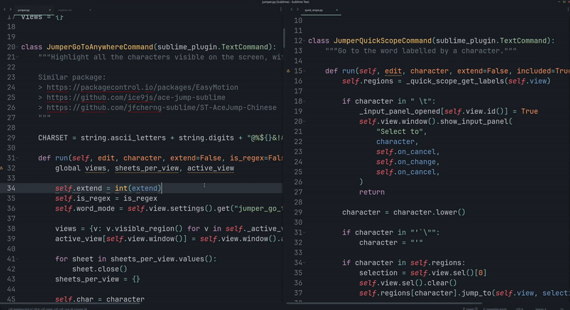
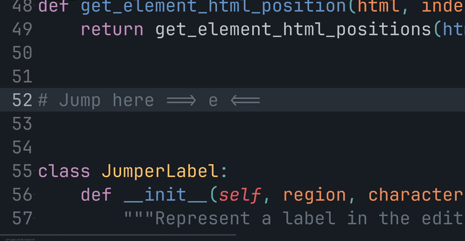
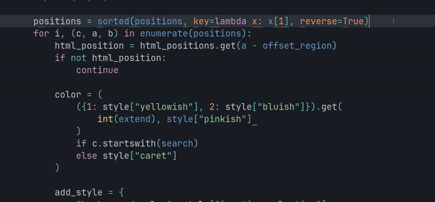
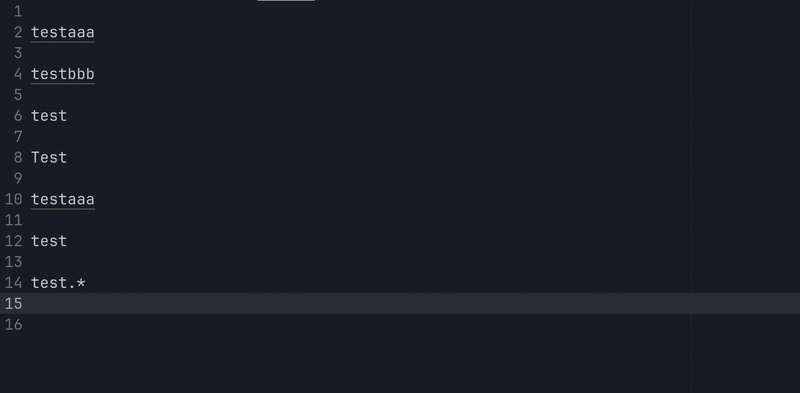
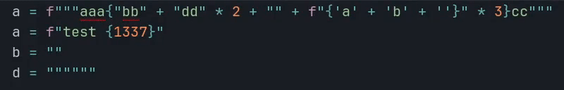
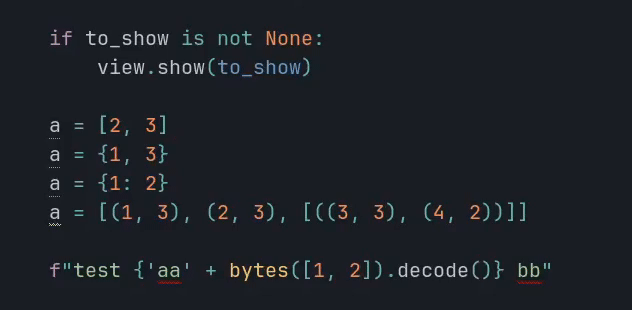

# Sublime - Jumper
## Go To Anywhere
Taking inspiration from [EasyMotion](https://github.com/tednaleid/sublime-EasyMotion) and [Ace Jump](https://github.com/acejump/AceJump) it's also possible to press a shortcut,
followed by a key, to highlight all matching character with a small label. Pressing the label jump to that position.
In that mode, you can press
- "`space`" then the label to select everything between the cursor and the target label excluded (the color will change)
- "`tab`" then the label to select everything between the cursor and the target label included (the color will change)
- "`|`" to keep the current selection and add a new cursor to the target

Example:
- `<shortcut> + a + x`: jump to the "a" labelled "x"
- `<shortcut> + a + " " + x`: select between the cursor and the "a" labelled "x" ("a" excluded)
- `<shortcut> + a + "tab" + x`: select between the cursor and the "a" labelled "x" ("a" included)
- `<shortcut> + " " + x`: jump to the beginning of the non-empty line labelled "x"

If the charset is not big enough, you can press many keys to jump where you want.

<p align="center">
  
</p>

```json
{
    "keys": ["find", "enter", "<character>"],
    "command": "jumper_go_to_anywhere",
},
{
    // Needed if we need to press shift for the target
    "keys": ["find", "enter", "shift", "<character>"],
    "command": "jumper_go_to_anywhere",
},
{   // Jump to end of non-empty line
    "keys": ["find", "enter", "tab"],
    "command": "jumper_go_to_anywhere",
    "args": {"character": "\t"},
},
{   // Jump to start of non-empty line
    "keys": ["find", "enter", "space"],
    "command": "jumper_go_to_anywhere",
    "args": {"character": " "},
},
````


The labels are **deterministic**, that way you can build muscle memory when you know how many matches are between the cursor and your target. You can change the charset to use your home row, the characters used:
- First match after the cursor: first letter of the charset
- First match before the cursor: second letter of the charset
- Second match after the cursor: third letter of the charset
- Second match before the cursor: fourth letter of the charset
- ...

```json
{
    "jumper_go_to_anywhere_charset": "tnseriaogmdhc,x.plfuwyvkbj:z123456789TNSERIAOGMDHCXPLFUWYVKBJ{}@%$&!#|^'-_=/;()"
}
```

You can type
- space to jump at the beginning of non-empty line
- tab to jump at the end of non-empty line

The jump work when many files are open (but not the extend, because we can not edit 2 files at the same time).

With `jumper_go_to_anywhere_case_sensitive`, you can make the search case insensitive, and the labels will also be lower case.

With `jumper_go_to_anywhere_word_mode`, you can only search at the beginning of the words (reducing the number of labels) and the selection will select the word and not the character.

Searching for quotes ``` `'" ``` will matches any quotes (same for labels).

You can be creative, it supports regex, for example, this is the same as the `HopWord` command from [hop.nvim](https://github.com/smoka7/hop.nvim)
```json
{
    "keys": ["find"],
    "command": "jumper_go_to_anywhere",
    "args": {
        "is_regex": true,
        "character": "(?<=\\W)\\w"
    },
},
```

When the label has more than one character (because a lot of text matched), you will see border around the label. The number of border is the number of time you need to press `.` before pressing the label to jump there. While you press `.`, the borders will be removed to show the remaining number of key press. If you don't like that, you can disable it with `jumper_go_to_anywhere_no_borders_label`.

<p align="center">
  
</p>

You can set the setting `jumper_go_to_anywhere_search_length`, if you want to type more than one character before typing the label. Set it to `2` to make the plugin work like [leap.vim](https://github.com/ggandor/leap.nvim)


## Technical
Sublime text doesn't support "phantom on top of text", so the default implementation use HTML sheet.

You can check the branch `master-all-labels-methods` to see all possible way to add labels
- phantoms: the text will shift to the right
- buffer: we will change the buffer, but the "redo" history can not be cleaned
- popup: we show a popup, but you will see a shadow and you can not jump to the first line
- sheet: the default implementation, only drawback is that when you are in "label typing" mode, you can not select text with the mousse

## Quick Scope
Taking inspiration from [Quick Scope](https://github.com/unblevable/quick-scope), each words get labelled by one letter inside of it,
pressing a shortcut and then that letter will jump at the **start** of the word (the label is case insensitive to go faster).

<p align="center">
  
</p>


```
This is a test
|    |  |  |

```
- `<shortcut> t`: jump to **start** of "this"
- `<shortcut> i`: jump to **start** of "is"
- `<shortcut> e`: jump to **start** of "test"

For the other lines, it will show one character per line to jump at the **start** of that line.

To enable the highlight, set the settings `jumper_quick_scope` to true. Or, if you want to enable the feature only for the current line, set it to `"line"`.

```json
{"jumper_quick_scope": true}
{"jumper_quick_scope": "line"}
```

You can also select until the matching word (that word included or not).

Like for "Go To Anywhere", you can press "space" or "tab" before pressing the label to select (included or not) until the match.

```json
{
    "keys": ["find", "<character>"],
    "command": "jumper_quick_scope"
},
{
    "keys": ["find", "tab"],
    "command": "jumper_quick_scope",
    "args": {"character": "\t"}
},
{
    "keys": ["shift+find", "<character>"],
    "command": "jumper_quick_scope",
    "args": {"extend": true}
}
```

A cool keybind is to use a shortcut for "Quick Scope", and that "shortcut, enter" for "Go To Anywhere" (since "enter" is not a valid quick scope search argument).

## Select Next Selection Match
The command `select_next_same_selection` will select the next / previous text matching the current selection
(you can also add it to the current selection, and it will be the same as `find_under_expand`).

Like `find_under_expand`,
- if you press the shortcut when no text selected, then it will search for the whole word
- if you press the shortcut when a text is selected, then it will select the next text (whole word or not)
- the difference is that you can go backward, and that it is always case sensitive

<p align="center">
  
</p>

A dot is displayed in the gutter for the "main cursors" when they are many (the cursor from which the selection will be extended).

That dot is "green" when in "text mode", or blue when in "word mode" (you pressed the shortcut without selecting anything).

## Select Selector

<p align="center">
  
</p>

The command `jumper_select_selector` select the next / previous text matching the sublime selector.

The idea is to have something similar than "select inside parenthesis" command of Vim.

See:
- https://www.sublimetext.com/docs/scope_naming.html
- https://www.sublimetext.com/docs/selectors.html

By default, the selector match the strings.

```json
// Select next / previous strings
{
    "keys": ["alt+ctrl+super+'"],
    "command": "jumper_select_selector"
},
{
    "keys": ["alt+ctrl+super+`"],
    "command": "jumper_select_selector",
    "args": {"direction": "previous"}
},
{
    "keys": ["shift+alt+ctrl+super+'"],
    "command": "jumper_select_selector",
    "args": {"extend": true}
},
{
    "keys": ["shift+alt+ctrl+super+`"],
    "command": "jumper_select_selector",
    "args": {"direction": "previous", "extend": true}
},
// Select next / previous class / function
{
    "keys": ["alt+ctrl+super+f"],
    "command": "jumper_select_selector",
    "args": {"selector": "entity.name"}
},
{
    "keys": ["alt+ctrl+super+w"],
    "command": "jumper_select_selector",
    "args": {"direction": "previous", "selector": "entity.name"}
}
// next / previous condition / loop
{
    "keys": ["alt+ctrl+super+i"],
    "command": "jumper_select_selector",
    "args": {
        "selector": "keyword.control.conditional | keyword.control.loop - keyword.control.loop.for.in",
    }
},
{
    "keys": ["alt+ctrl+super+e"],
    "command": "jumper_select_selector",
    "args": {
        "direction": "previous",
        "selector": "keyword.control.conditional | keyword.control.loop - keyword.control.loop.for.in",
    }
},
{
"keys": ["shift+alt+ctrl+super+i"],
    "command": "jumper_select_selector",
    "args": {
        "extend": true,
        "selector": "keyword.control.conditional | keyword.control.loop - keyword.control.loop.for.in",
    }
},
{
"keys": ["shift+alt+ctrl+super+e"],
    "command": "jumper_select_selector",
    "args": {
        "selector": "keyword.control.conditional | keyword.control.loop - keyword.control.loop.for.in",
        "direction": "previous",
        "extend": true
    }
},
```

## Select Next / Previous Bracket Content
Select the content of the next / previous `(){}[]` (using selector, to skip false positive).

<p align="center">
  
</p>


```json
{
    "keys": ["alt+ctrl+super+]"],
    "command": "jumper_select_next_bracket",
},
{
    "keys": ["alt+ctrl+super+["],
    "command": "jumper_select_next_bracket",
    "args": {"direction": "previous"}
},
{
    "keys": ["shift+alt+ctrl+super+]"],
    "command": "jumper_select_next_bracket",
    "args": {"extend": true}
},
{
    "keys": ["shift+alt+ctrl+super+["],
    "command": "jumper_select_next_bracket",
    "args": {"direction": "previous", "extend": true}
},
```

Or if you want to select the next / previous parenthesis content:
```json
{
    "keys": ["alt+ctrl+super+]"],
    "command": "jumper_select_next_bracket",
    "args": {
      "brackets_text": "()"
    },
},
{
    "keys": ["alt+ctrl+super+["],
    "command": "jumper_select_next_bracket",
    "args": {"direction": "previous", "brackets_text": "()"}
},
{
    "keys": ["shift+alt+ctrl+super+]"],
    "command": "jumper_select_next_bracket",
    "args": {"extend": true, "brackets_text": "()"}
},
{
    "keys": ["shift+alt+ctrl+super+["],
    "command": "jumper_select_next_bracket",
    "args": {"direction": "previous", "extend": true, "brackets_text": "()"}
}
```

If you are inside `()`, selecting "previous ()" will select the parent parenthesis, while selecting "next ()" will select the next one.

## Go To Previous Modification
["Go To Modification" on steroid. (see demo)](https://youtu.be/QUIU8pPL6QE) The command `jumper_previous_modification` allow you to go to the next / previous modification, even if it was
- in a different tab
- in a different panel
- in a different window
- in a non-saved sheet

It will remember where the file was opened, and try to re-open it at the same place if possible (if not, it will re-open the file in the current window).

By default, it won't jump many time on the same line.

You can also go to next / previous modified file.

```json
{
    "keys": ["ctrl+,"],
    "command": "jumper_previous_modification"
},
{
    "keys": ["ctrl+."],
    "command": "jumper_previous_modification",
    "args": {"direction": "next"}
},
{
    "keys": ["ctrl+shift+,"],
    "command": "jumper_previous_modification",
    "args": {"per_file": true}
},
{
    "keys": ["ctrl+shift+."],
    "command": "jumper_previous_modification",
    "args": {"direction": "next", "per_file": true}
},
```

If it open a new sheet, it will be closed automatically if no modification are made inside.

Run the command `jumper_previous_modification_panel` to open a panel with the history.

# TODO
- Remove `create_keybind.py` and add keybind in the readme once https://github.com/sublimehq/sublime_text/issues/6650 is fixed
- Find a way to add letter as row number to jump faster, once https://github.com/sublimehq/sublime_text/issues/6654 is done
- "Go To Anywhere", when clicking on a tab, the input panel should close
- "Go To Anywhere", read `word_wrap` settings (set to "auto"), seems to be `&nbsp;`, but a bit tricky to split the lines at the same place (it change depending on the language)
- Improve `select_selector` once https://github.com/sublimehq/sublime_text/issues/6660 is fixed
