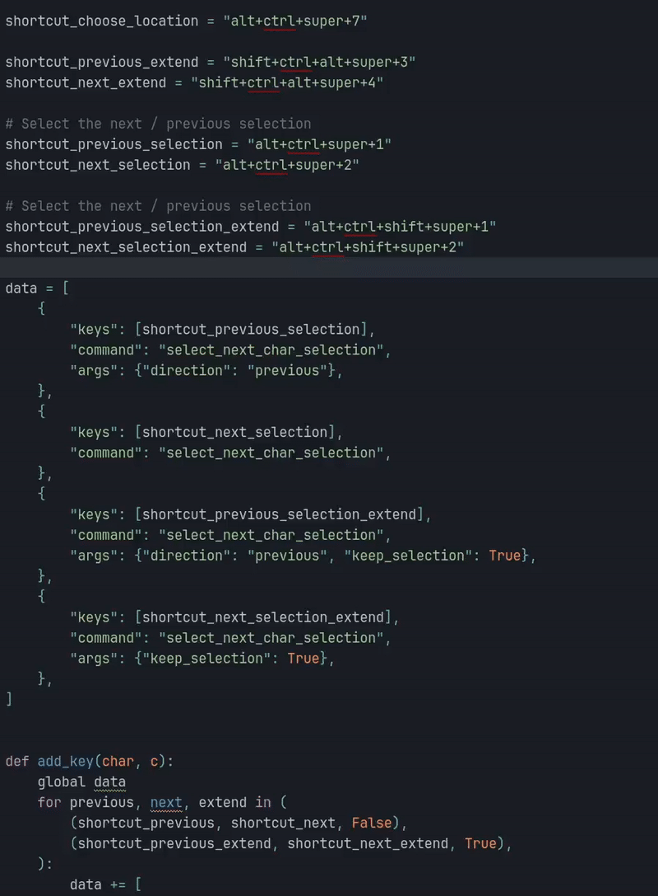

# Sublime - Select Next Char
Press a shortcut, then a key to select the next / previous character corresponding to the key pressed.

Because of the way shortcut work in sublime, you need to run `create_keybind.py` in order to generate the shortcut file.

An other shortcut can select the next / previous text matching the current selection.


Taking inspiration from [EasyMotion](https://github.com/tednaleid/sublime-EasyMotion), it's also possible to press a shortcut,
followed by a key, to highlight all matching character with a small label. Pressing the label jump to that position.



Settings
```json
{
    "select_next_char_charset": "tnseriaogmdhc,x.plfuwyvkbj:z123456789TNSERIAOGMDHCXPLFUWYVKBJ{}@%$&!#|^'-_=/;()"
}
```

You can type
- space to jump at the beginning of non-empty line
- tab to jump at the end of non-empty line

In extend mode, press enter to enter in multi-selection mode. Then you can press a letter, then it's label many time. When you are done, press escape.

The jump work when many files are open (but not the extend, because we can not edit 2 files at the same time).
