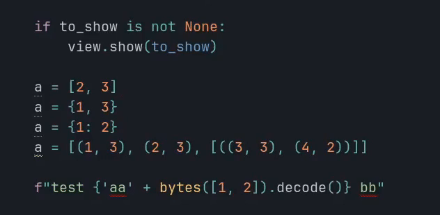

# Sublime - Jumper
## Go To Anywhere
Taking inspiration from [EasyMotion](https://github.com/tednaleid/sublime-EasyMotion) and [Ace Jump](https://github.com/acejump/AceJump) it's also possible to press a shortcut,
followed by a key, to highlight all matching character with a small label. Pressing the label jump to that position.
In that mode, you can press
- "space" then the label to select everything between the cursor and the target label excluded (the color will change)
- "tab" then the label to select everything between the cursor and the target label included (the color will change)

Example:
- `<shortcut> + a + x`: jump to the "a" labelled "x"
- `<shortcut> + a + " " + x`: select between the cursor and the "a" labelled "x" ("a" excluded)
- `<shortcut> + a + "tab" + x`: select between the cursor and the "a" labelled "x" ("a" included)
- `<shortcut> + " " + x`: jump to the beginning of the non-empty line labelled "x"

If the charset is not big enough, you can press many keys to jump where you want.

[](https://www.youtube.com/watch?v=AVkC4VIXuBY)

Settings
```json
{
    "jumper_go_to_anywhere_charset": "tnseriaogmdhc,x.plfuwyvkbj:z123456789TNSERIAOGMDHCXPLFUWYVKBJ{}@%$&!#|^'-_=/;()"
}
```

You can type
- space to jump at the beginning of non-empty line
- tab to jump at the end of non-empty line

The jump work when many files are open (but not the extend, because we can not edit 2 files at the same time).

## Technical
Sublime text doesn't support "phantom on top of text", so the default implementation use HTML sheet.

You can check the branch `master-all-labels-methods` to see all possible way to add labels
- phantoms: the text will shift to the right
- buffer: we will change the buffer, but the "redo" history can not be cleaned
- popup: we show a popup, but you will see a shadow and you can not jump to the first line
- sheet: the default implementation, only drawback is that when you are in "label typing" mode, you can not select text with the mousse

## Quick Scope
Taking inspiration from [Quick Scope](https://github.com/unblevable/quick-scope), each words get labelled by one letter inside of it,
pressing a shortcut and then that letter will jump at the *start* of the word (the label is case insensitive to go faster).

> https://youtu.be/5HcNKD383ek

```
This is a test
|    |  |  |

```
- `<shortcut> t`: jump to *start* of "this"
- `<shortcut> i`: jump to *start* of "is"
- `<shortcut> e`: jump to *start* of "test"

For the other lines, it will show one character per line to jump at the start of that line.

To enable the highlight, set the settings `jumper_quick_scope` to true. Or, if you want to enable the feature only for the current line, set it to `"line"`.

```json
{"jumper_quick_scope": true}
{"jumper_quick_scope": "line"}
```

You can also select until the matching word (that word included or not).

Like for "Go To Anywhere", you can press "space" or "tab" before pressing the label to select (included or not) until the match.

```json
{
    "keys": ["find", "<character>"],
    "command": "jumper_quick_scope"
},
{
    "keys": ["find", "tab"],
    "command": "jumper_quick_scope",
    "args": {"character": "\t"}
},
{
    "keys": ["shift+find", "<character>"],
    "command": "jumper_quick_scope",
    "args": {"extend": true}
}
```

## Select Next Selection Match
The command `select_next_same_selection` will select the next / previous text matching the current selection
(you can also add it to the current selection, and it will be the same as `find_under_expand`).

## Select Selector
The command `jumper_select_selector` select the next / previous text matching the sublime selector.

The idea is to have something similar than "select inside parenthesis" command of Vim.

See:
- https://www.sublimetext.com/docs/scope_naming.html
- https://www.sublimetext.com/docs/selectors.html

By default, the selector match the strings.

```json
// Select strings
{
    "keys": ["alt+ctrl+super+0"],
    "command": "jumper_select_selector"
},
{
    "keys": ["alt+ctrl+super+9"],
    "command": "jumper_select_selector",
    "args": {"direction": "previous"}
},
{
    "keys": ["shift+alt+ctrl+super+0"],
    "command": "jumper_select_selector",
    "args": {"extend": true}
},
{
    "keys": ["shift+alt+ctrl+super+9"],
    "command": "jumper_select_selector",
    "args": {"direction": "previous", "extend": true}
},
// Select class / function
{
    "keys": ["alt+ctrl+super+q"],
    "command": "jumper_select_selector",
    "args": {"selector": "entity.name"}
},
{
    "keys": ["alt+ctrl+super+w"],
    "command": "jumper_select_selector",
    "args": {"direction": "previous", "selector": "entity.name"}
}
// Jump to next / previous condition / loop
{
    "keys": ["alt+ctrl+super+i"],
    "command": "jumper_select_selector",
    "args": {
        "selector": "keyword.control.conditional | keyword.control.loop - keyword.control.loop.for.in",
    }
},
{
    "keys": ["alt+ctrl+super+e"],
    "command": "jumper_select_selector",
    "args": {
        "direction": "previous",
        "selector": "keyword.control.conditional | keyword.control.loop - keyword.control.loop.for.in",
    }
},
{
"keys": ["shift+alt+ctrl+super+i"],
    "command": "jumper_select_selector",
    "args": {
        "extend": true,
        "selector": "keyword.control.conditional | keyword.control.loop - keyword.control.loop.for.in",
    }
},
{
"keys": ["shift+alt+ctrl+super+e"],
    "command": "jumper_select_selector",
    "args": {
        "selector": "keyword.control.conditional | keyword.control.loop - keyword.control.loop.for.in",
        "direction": "previous",
        "extend": true
    }
},
```

# Select Next / Previous Bracket Content
Select the content of the next / previous `(){}[]` (using selector, to skip false positive).



```json
{
    "keys": ["alt+ctrl+super+]"],
    "command": "jumper_select_next_bracket",
},
{
    "keys": ["alt+ctrl+super+["],
    "command": "jumper_select_next_bracket",
    "args": {"direction": "previous"}
},
{
    "keys": ["shift+alt+ctrl+super+]"],
    "command": "jumper_select_next_bracket",
    "args": {"extend": true}
},
{
    "keys": ["shift+alt+ctrl+super+["],
    "command": "jumper_select_next_bracket",
    "args": {"direction": "previous", "extend": true}
},
```

# TODO
- Remove `create_keybind.py` and add keybind in the readme once https://github.com/sublimehq/sublime_text/issues/6650 is fixed
- Find a way to add letter as row number to jump faster
- "Go To Anywhere", when clicking on a tab, the input panel should close
- "Go To Anywhere", read `word_wrap` settings (set to "auto")
- Improve `select_selector` once https://github.com/sublimehq/sublime_text/issues/6660 is fixed
- Skip current selection (like ctrl+k, ctrl+d)
